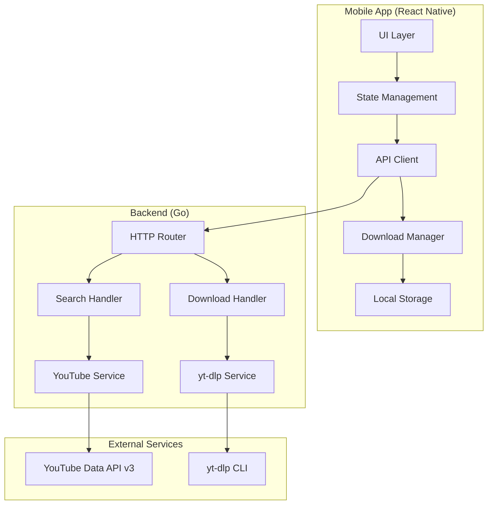

# Design Document

## Overview

The YouTube Video Downloader is a cross-platform mobile application built with React Native (without Expo) and a Go backend service. The system enables users to search for YouTube videos and download them in various formats with customizable quality settings. The architecture follows a client-server model where the mobile app handles UI/UX and the backend manages YouTube API integration and video processing via yt-dlp.

### Key Design Principles

- **Separation of Concerns**: Clear separation between presentation (React Native), business logic (Go backend), and external services (YouTube API, yt-dlp)
- **Responsive Design**: Vibrant, engaging UI with smooth animations and 60fps performance
- **Offline-First**: Downloads continue in background, with proper state management
- **Theme Support**: Dynamic dark/light mode with vibrant color schemes
- **Error Resilience**: Comprehensive error handling with user-friendly messages and retry mechanisms

## Architecture

### System Architecture



### Mobile App Architecture (React Native)

The mobile app follows a layered architecture:

1. **Presentation Layer**: React components with hooks for state management
2. **State Management Layer**: Context API + useReducer for global state (downloads, theme)
3. **Service Layer**: API client, download manager, storage utilities
4. **Navigation Layer**: React Navigation for screen transitions

### Backend Architecture (Go)

The backend follows a clean architecture pattern:

1. **HTTP Layer**: Gin/Echo router with middleware (CORS, logging, error handling)
2. **Handler Layer**: Request validation and response formatting
3. **Service Layer**: Business logic for search and download operations
4. **Integration Layer**: YouTube API client and yt-dlp wrapper

## Components and Interfaces

### Mobile App Components

#### 1. Navigation Structure

```typescript
// Navigation hierarchy
AppNavigator
├── SplashScreen
└── MainNavigator
    └── BrowseScreen
        └── DownloadModal (Modal)
```

#### 2. Core Components

**SplashScreen**

- Purpose: Display branding and initialize app
- Props: None
- State: Loading status
- Features: Animated logo, theme-aware colors, initialization logic

**BrowseScreen**

- Purpose: Main screen with search and results
- Props: None
- State: Search query, results, loading state
- Features: Search bar, results list, pull-to-refresh

**SearchBar**

- Purpose: Input component for search queries
- Props: onSearch, placeholder, value
- State: Input text
- Features: Debounced input, clear button, submit on enter

**VideoResultCard**

- Purpose: Display individual video result
- Props: video (id, title, thumbnail, duration, channel)
- State: Image loading state
- Features: Thumbnail with placeholder, formatted duration, tap handler

**DownloadModal**

- Purpose: Configure and initiate downloads
- Props: video, visible, onClose
- State: Selected format, quality, location, download progress
- Features: Format selector, quality selector, location picker, progress bar

**LoadingAnimation**

- Purpose: Display loading states
- Props: type (search, download, general), visible
- State: Animation progress
- Features: Lottie animations, vibrant colors, smooth transitions

**ThemeProvider**

- Purpose: Manage app-wide theming
- Props: children
- State: Current theme (dark/light), color palette
- Features: System theme detection, dynamic color switching

#### 3. Custom Hooks

```typescript
// useTheme: Access current theme and colors
const { theme, colors, isDark } = useTheme();

// useDownloads: Manage download queue and state
const { downloads, startDownload, cancelDownload } = useDownloads();

// useSearch: Handle search operations
const { results, loading, error, search } = useSearch();
```

### Backend Components

#### 1. API Endpoints

**Search Endpoint**

```
POST /api/v1/search
Request Body: { "query": string, "maxResults": number }
Response: { "videos": Video[], "nextPageToken": string }
```

**Download Endpoint**

```
POST /api/v1/download
Request Body: { "url": string, "format": string, "quality": string }
Response: Binary stream (video file)
Headers: Content-Type, Content-Disposition, Content-Length
```

**Formats Endpoint**

```
GET /api/v1/formats?url=<youtube_url>
Response: { "formats": Format[] }
```

#### 2. Service Interfaces

**YouTube Service**

```go
type YouTubeService interface {
    Search(ctx context.Context, query string, maxResults int) ([]Video, error)
    GetVideoDetails(ctx context.Context, videoID string) (*VideoDetails, error)
}
```

**Download Service**

```go
type DownloadService interface {
    GetAvailableFormats(ctx context.Context, url string) ([]Format, error)
    DownloadVideo(ctx context.Context, req DownloadRequest) (io.ReadCloser, error)
}
```

## Data Models

### Mobile App Models

```typescript
// Video model
interface Video {
  id: string;
  title: string;
  thumbnailUrl: string;
  duration: number; // in seconds
  channelName: string;
  channelId: string;
  publishedAt: string;
  viewCount?: number;
}

// Download model
interface Download {
  id: string;
  video: Video;
  format: VideoFormat;
  quality: VideoQuality;
  status: DownloadStatus;
  progress: number; // 0-100
  filePath?: string;
  error?: string;
  createdAt: Date;
}

// Format options
type VideoFormat = 'mp4' | 'webm' | 'mp3' | 'mkv';
type VideoQuality =
  | '144p'
  | '240p'
  | '360p'
  | '480p'
  | '720p'
  | '1080p'
  | '1440p'
  | '2160p'
  | 'audio_only';
type DownloadStatus =
  | 'pending'
  | 'downloading'
  | 'completed'
  | 'failed'
  | 'cancelled';

// Theme model
interface Theme {
  mode: 'light' | 'dark';
  colors: ColorPalette;
}

interface ColorPalette {
  primary: string;
  secondary: string;
  background: string;
  surface: string;
  text: string;
  textSecondary: string;
  error: string;
  success: string;
  border: string;
}
```

### Backend Models

```go
// Video represents a YouTube video
type Video struct {
    ID           string    `json:"id"`
    Title        string    `json:"title"`
    ThumbnailURL string    `json:"thumbnailUrl"`
    Duration     int       `json:"duration"`
    ChannelName  string    `json:"channelName"`
    ChannelID    string    `json:"channelId"`
    PublishedAt  time.Time `json:"publishedAt"`
    ViewCount    int64     `json:"viewCount,omitempty"`
}

// SearchRequest represents a search query
type SearchRequest struct {
    Query      string `json:"query" binding:"required"`
    MaxResults int    `json:"maxResults" binding:"min=1,max=50"`
}

// SearchResponse represents search results
type SearchResponse struct {
    Videos        []Video `json:"videos"`
    NextPageToken string  `json:"nextPageToken,omitempty"`
}

// DownloadRequest represents a download request
type DownloadRequest struct {
    URL     string `json:"url" binding:"required,url"`
    Format  string `json:"format" binding:"required,oneof=mp4 webm mp3 mkv"`
    Quality string `json:"quality" binding:"required"`
}

// Format represents available video format
type Format struct {
    FormatID   string `json:"formatId"`
    Extension  string `json:"extension"`
    Resolution string `json:"resolution"`
    FPS        int    `json:"fps,omitempty"`
    FileSize   int64  `json:"fileSize,omitempty"`
    Bitrate    int    `json:"bitrate,omitempty"`
}
```

## Error Handling

### Mobile App Error Handling

**Error Categories**:

1. **Network Errors**: Connection failures, timeouts
2. **API Errors**: 4xx/5xx responses from backend
3. **Download Errors**: File system errors, insufficient storage
4. **Validation Errors**: Invalid user input

**Error Handling Strategy**:

```typescript
// Centralized error handler
class ErrorHandler {
  static handle(error: AppError): UserFacingError {
    // Log error for debugging
    console.error(error);

    // Map to user-friendly message
    const message = this.getUserMessage(error);

    // Determine if retryable
    const canRetry = this.isRetryable(error);

    return { message, canRetry };
  }
}

// Error boundary for React components
class ErrorBoundary extends React.Component {
  // Catch rendering errors and display fallback UI
}
```

**Retry Logic**:

- Network errors: Exponential backoff (1s, 2s, 4s, 8s)
- Download failures: Manual retry with option to change format
- API errors: Retry on 5xx, don't retry on 4xx

### Backend Error Handling

**Error Response Format**:

```go
type ErrorResponse struct {
    Error   string `json:"error"`
    Message string `json:"message"`
    Code    string `json:"code"`
}
```

**Error Handling Middleware**:

```go
func ErrorHandlerMiddleware() gin.HandlerFunc {
    return func(c *gin.Context) {
        c.Next()

        if len(c.Errors) > 0 {
            err := c.Errors.Last()

            // Map error to HTTP status and response
            status, response := mapError(err)
            c.JSON(status, response)
        }
    }
}
```

**Error Categories**:

1. **Validation Errors**: 400 Bad Request
2. **YouTube API Errors**: 502 Bad Gateway or 503 Service Unavailable
3. **yt-dlp Errors**: 500 Internal Server Error with specific message
4. **Not Found**: 404 when video unavailable

## Testing Strategy

### Mobile App Testing

**Unit Tests**:

- Custom hooks (useTheme, useDownloads, useSearch)
- Utility functions (formatDuration, formatFileSize)
- API client methods
- State reducers

**Component Tests**:

- SearchBar: Input handling, validation, submission
- VideoResultCard: Rendering, image loading, tap handling
- DownloadModal: Format selection, validation, download initiation
- LoadingAnimation: Animation states, visibility

**Integration Tests**:

- Search flow: Input → API call → Results display
- Download flow: Selection → Configuration → Download → Storage
- Theme switching: System theme detection → App theme update

**E2E Tests** (using Detox):

- Complete user journey: Launch → Search → Select → Download
- Background download continuation
- Error scenarios and recovery

### Backend Testing

**Unit Tests**:

- YouTube service: API response parsing
- Download service: yt-dlp command construction
- Validators: Request validation logic
- Utilities: Format conversion, duration parsing

**Integration Tests**:

- Search endpoint: Request → YouTube API → Response
- Download endpoint: Request → yt-dlp → Stream response
- Error handling: Invalid requests, API failures

**Load Tests**:

- Concurrent download requests
- Large file streaming
- API rate limiting

### Testing Tools

**Mobile**:

- Jest: Unit and component tests
- React Native Testing Library: Component testing
- Detox: E2E testing
- Mock Service Worker: API mocking

**Backend**:

- Go testing package: Unit tests
- Testify: Assertions and mocking
- httptest: HTTP handler testing
- Gomock: Interface mocking

## UI/UX Design Specifications

### Color Palette

**Light Mode**:

```typescript
const lightColors = {
  primary: '#FF6B6B', // Vibrant red
  secondary: '#4ECDC4', // Vibrant teal
  accent: '#FFE66D', // Vibrant yellow
  background: '#FFFFFF',
  surface: '#F7F7F7',
  text: '#2D3436',
  textSecondary: '#636E72',
  error: '#FF3838',
  success: '#00B894',
  border: '#DFE6E9',
};
```

**Dark Mode**:

```typescript
const darkColors = {
  primary: '#FF6B6B', // Vibrant red
  secondary: '#4ECDC4', // Vibrant teal
  accent: '#FFE66D', // Vibrant yellow
  background: '#1A1A1A',
  surface: '#2D2D2D',
  text: '#FFFFFF',
  textSecondary: '#B2BEC3',
  error: '#FF3838',
  success: '#00B894',
  border: '#3D3D3D',
};
```

### Typography

```typescript
const typography = {
  h1: { fontSize: 32, fontWeight: '700', lineHeight: 40 },
  h2: { fontSize: 24, fontWeight: '600', lineHeight: 32 },
  h3: { fontSize: 18, fontWeight: '600', lineHeight: 24 },
  body: { fontSize: 16, fontWeight: '400', lineHeight: 24 },
  caption: { fontSize: 14, fontWeight: '400', lineHeight: 20 },
  button: { fontSize: 16, fontWeight: '600', lineHeight: 24 },
};
```

### Spacing System

```typescript
const spacing = {
  xs: 4,
  sm: 8,
  md: 16,
  lg: 24,
  xl: 32,
  xxl: 48,
};
```

### Animation Specifications

**Transitions**:

- Screen transitions: 300ms ease-in-out
- Modal animations: 250ms ease-out
- Button press: 150ms ease-in
- Loading states: Continuous smooth animation

**Loading Animations**:

- Use Lottie for complex animations
- Fallback to ActivityIndicator for simple cases
- Color-matched to theme

### Component Specifications

**SearchBar**:

- Height: 48px
- Border radius: 24px
- Padding: 12px 16px
- Icon size: 20px
- Debounce: 300ms

**VideoResultCard**:

- Height: 100px
- Thumbnail: 16:9 aspect ratio, 120px width
- Padding: 12px
- Border radius: 8px
- Elevation/shadow on press

**DownloadModal**:

- Max height: 80% of screen
- Border radius: 16px (top corners)
- Backdrop: Semi-transparent black (0.5 opacity)
- Padding: 24px

## Performance Optimizations

### Mobile App Optimizations

1. **Image Loading**:

   - Use react-native-fast-image for caching
   - Lazy load images as user scrolls
   - Compress thumbnails on backend

2. **List Rendering**:

   - Use FlatList with optimized props (windowSize, maxToRenderPerBatch)
   - Implement getItemLayout for fixed-height items
   - Use React.memo for VideoResultCard

3. **State Management**:

   - Minimize re-renders with useMemo and useCallback
   - Split context providers to avoid unnecessary updates
   - Use reducer for complex state logic

4. **Download Management**:

   - Use react-native-fs for file operations
   - Implement download queue with concurrency limit (3 concurrent)
   - Stream large files instead of loading into memory

5. **Bundle Size**:
   - Code splitting where possible
   - Remove unused dependencies
   - Optimize images and assets

### Backend Optimizations

1. **YouTube API**:

   - Cache search results (5 minutes TTL)
   - Batch requests where possible
   - Implement rate limiting to avoid quota exhaustion

2. **Video Streaming**:

   - Stream files directly without buffering entire file
   - Use chunked transfer encoding
   - Implement range requests for resume capability

3. **yt-dlp Integration**:

   - Reuse yt-dlp process pool
   - Cache format information
   - Timeout long-running downloads (30 minutes)

4. **Concurrency**:
   - Use goroutines for concurrent downloads
   - Implement worker pool pattern
   - Limit concurrent yt-dlp processes (10 max)

## Security Considerations

### Mobile App Security

1. **API Communication**:

   - Use HTTPS only
   - Implement certificate pinning
   - Validate SSL certificates

2. **Data Storage**:

   - Store API keys in secure storage (Keychain/Keystore)
   - Don't log sensitive information
   - Clear cache on app uninstall

3. **Input Validation**:
   - Sanitize search queries
   - Validate file paths
   - Prevent path traversal attacks

### Backend Security

1. **API Security**:

   - Rate limiting (100 requests/minute per IP)
   - CORS configuration (whitelist mobile app)
   - Request size limits (10MB max)

2. **YouTube API**:

   - Store API key in environment variables
   - Rotate keys periodically
   - Monitor quota usage

3. **yt-dlp Security**:

   - Validate YouTube URLs
   - Sanitize command arguments
   - Run in isolated environment (container)
   - Timeout protection

4. **File Handling**:
   - Validate file types
   - Scan for malware (optional)
   - Clean up temporary files

## Deployment Architecture

### Mobile App Deployment

**Build Configuration**:

- Development: Debug builds with dev API endpoint
- Staging: Release builds with staging API endpoint
- Production: Signed release builds with production API endpoint

**Distribution**:

- Android: Google Play Store (AAB format)
- iOS: Apple App Store (IPA format)

### Backend Deployment

**Infrastructure**:

```
Load Balancer
    ↓
API Servers (3+ instances)
    ↓
YouTube API / yt-dlp
```

**Containerization**:

```dockerfile
# Dockerfile for Go backend
FROM golang:1.21-alpine AS builder
# Build steps...

FROM alpine:latest
RUN apk add --no-cache yt-dlp ffmpeg
COPY --from=builder /app/server /server
CMD ["/server"]
```

**Environment Variables**:

- `YOUTUBE_API_KEY`: YouTube Data API key
- `PORT`: Server port (default: 8080)
- `MAX_CONCURRENT_DOWNLOADS`: Concurrent download limit
- `CACHE_TTL`: Search cache TTL in seconds
- `LOG_LEVEL`: Logging level

**Scaling Strategy**:

- Horizontal scaling for API servers
- Shared cache (Redis) for search results
- CDN for static assets (if any)

## Dependencies

### Mobile App Dependencies

**Core**:

- react-native: ^0.72.0
- react: ^18.2.0
- react-navigation: ^6.0.0

**UI**:

- react-native-reanimated: ^3.0.0 (animations)
- lottie-react-native: ^6.0.0 (loading animations)
- react-native-fast-image: ^8.6.0 (image caching)

**Utilities**:

- axios: ^1.4.0 (HTTP client)
- react-native-fs: ^2.20.0 (file system)
- @react-native-async-storage/async-storage: ^1.19.0 (storage)

**Development**:

- typescript: ^5.0.0
- @types/react: ^18.2.0
- jest: ^29.0.0
- @testing-library/react-native: ^12.0.0

### Backend Dependencies

**Core**:

- github.com/gin-gonic/gin: HTTP framework
- google.golang.org/api/youtube/v3: YouTube API client

**Utilities**:

- github.com/joho/godotenv: Environment variables
- github.com/sirupsen/logrus: Logging
- github.com/go-redis/redis/v8: Caching (optional)

**Testing**:

- github.com/stretchr/testify: Testing utilities
- github.com/golang/mock: Mocking

**External**:

- yt-dlp: Video download tool (system dependency)
- ffmpeg: Video processing (system dependency)

## Future Enhancements

1. **Download History**: Track and display past downloads
2. **Playlists**: Support downloading entire playlists
3. **Subtitles**: Option to download subtitles
4. **Audio Extraction**: Extract audio from videos
5. **Quality Auto-Select**: Automatically select best quality based on network
6. **Offline Mode**: View download history offline
7. **Share Feature**: Share videos with other apps
8. **Notifications**: Rich notifications with download progress
9. **Widget**: Home screen widget showing download status
10. **Cloud Sync**: Sync downloads across devices (requires user system)
